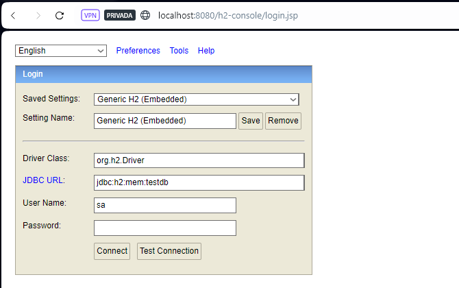
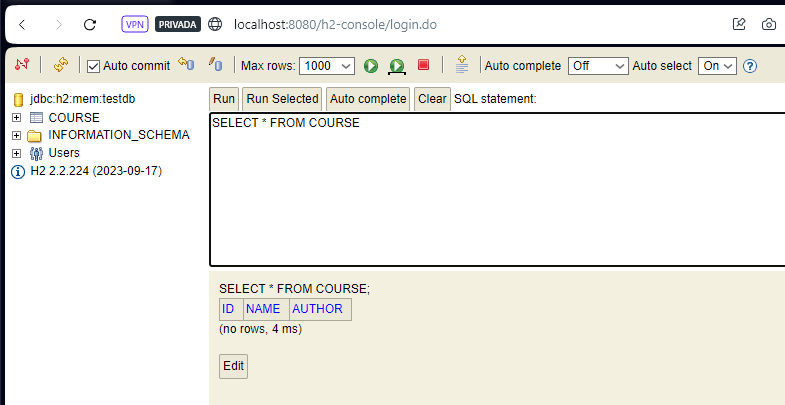
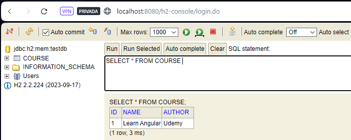

# Course Application - Learning Spring Data JPA

This is a learning project taken from the Udemy course [Master Spring Boot 3 & Spring Framework 6 with Java](https://www.udemy.com/course/spring-boot-and-spring-framework-tutorial-for-beginners/) which showcases the core concepts of JDBC, Spring JDBC, JPA and Spring Data JPA.

### Prerequisites

To use this project, you need to have knowledge of:

+ Java - Object Oriented Programming Language.
+ Spring Boot - Create stand-alone Spring applications.

### Installing the Project

To download this project, run the following command down below.

```
git clone https://github.com/JuanPablo70/CourseApplication.git
```

### About this Project

This project focuses on the application of Spring JDBC and Spring Data JPA to perform queries on a database containing a Courses table. The main objective is to demonstrate the advantages of using Spring Data JPA across several iterations.

+ **Iteration 1: Configuring the Courses table in H2**

    In this stage, we show how to configure the application.properties file to enable the H2 console and create the schema.sql file to define the structure of the courses table in the database.

  

  

+ **Iterations 2, 3, and 4: Using Spring JDBC**

    During these phases, we illustrate the use of Spring JDBC to perform queries on the courses table. We have developed a JDBC repository (CourseJdbcRepository) annotated with @Repository, which contains the logic to execute queries on the table, and a component (CourseJdbcCommandLineRunner) responsible for executing these queries. A significant advantage of using Spring JDBC is the considerable reduction in the amount of Java code required compared to direct JDBC usage, although it does require writing numerous SQL queries.

  

+ **Iteration 5: Implementation of JPA**

    In this stage, a new repository (CourseJpaRepository) is created using the @Repository and @Transactional annotations, and injecting the EntityManager dependency with the @PersistentContext annotation, which is more specific than Autowired, to avoid manual query writing. To make the most of JPA, it is essential to use the @Entity annotation to map application objects to entities in the database.

+ **Iterations 6 and 7: Utilizing Spring Data JPA**

    In these final stages, an interface (CourseSpringDataJpaRepository) is created that extends JpaRepository, further simplifying query writing for the courses table. If additional queries are needed, they can simply be implemented in the interface, following the established standards for writing required queries, and they will be ready to use without complications.

### Build With

+ [Spring Initializr](https://start.spring.io) - Tool used to set up Spring Boot projects.
+ [Maven](https://maven.apache.org) - Software project management and comprehension tool.

### Version

1.0

### Author

[Juan Pablo Sánchez Bermúdez](https://github.com/JuanPablo70)
